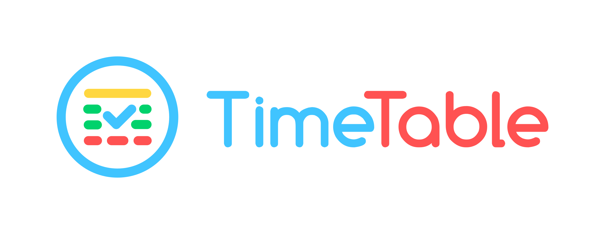
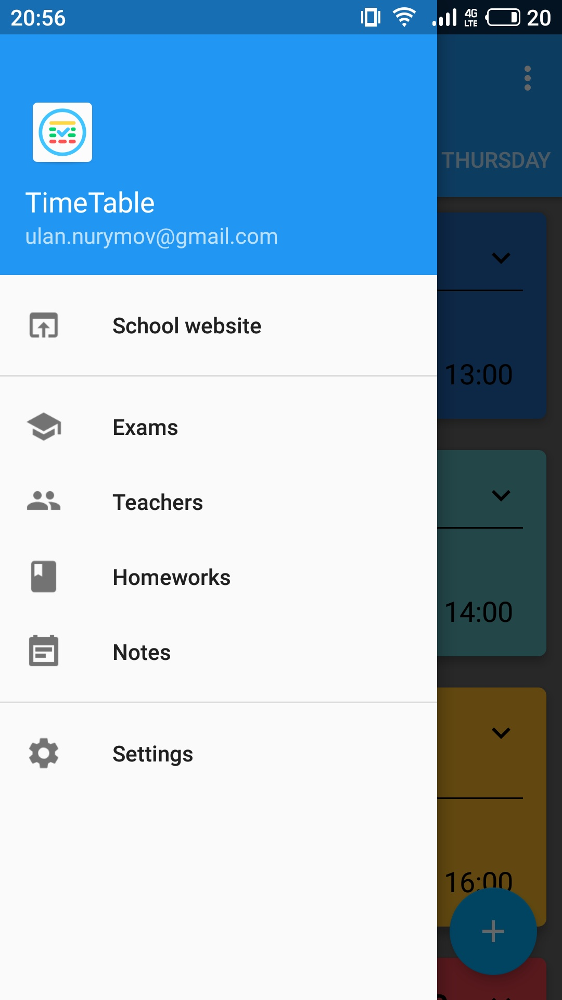
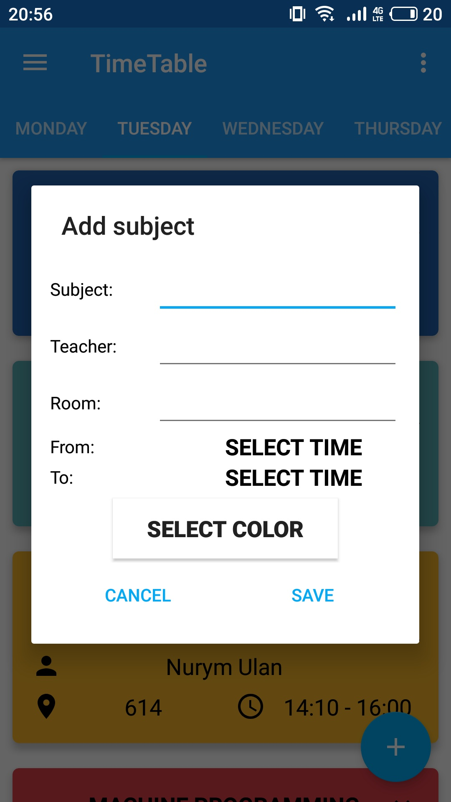
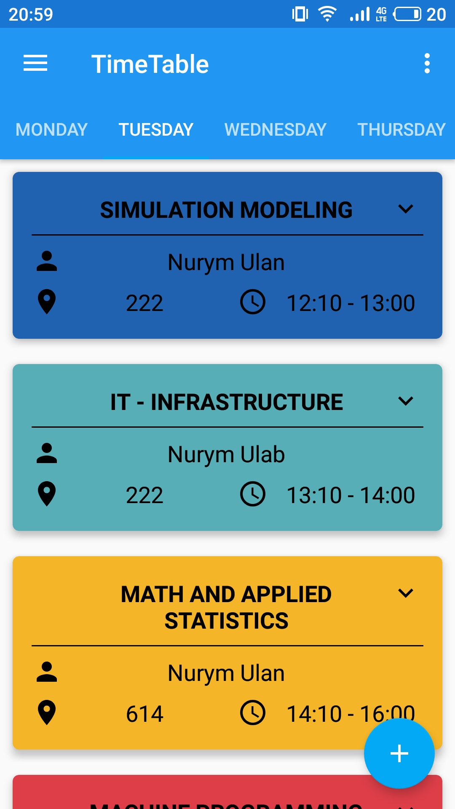

# TimeTable
<h1 align=center>

</h1>

Timetable is an Android Application, which allows you to save timetable, homeworks and notes.

### Contribute

You are welcome to contribute with issues, pull requests and ideas. And to contribute to this project, please fork the project and submit a pull request. 

### Screenshots
 &nbsp;&nbsp;&nbsp;&nbsp;  &nbsp;&nbsp;&nbsp;&nbsp; 

### Licence

The source code is licensed under the [GNU v3 Public License](https://github.com/ulan17/TimeTable/blob/master/LICENSE). 
