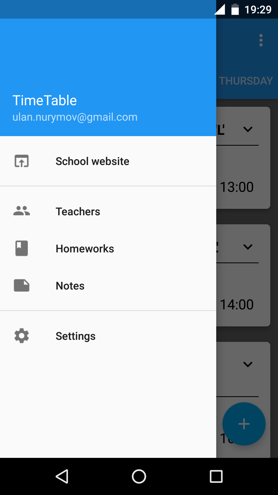
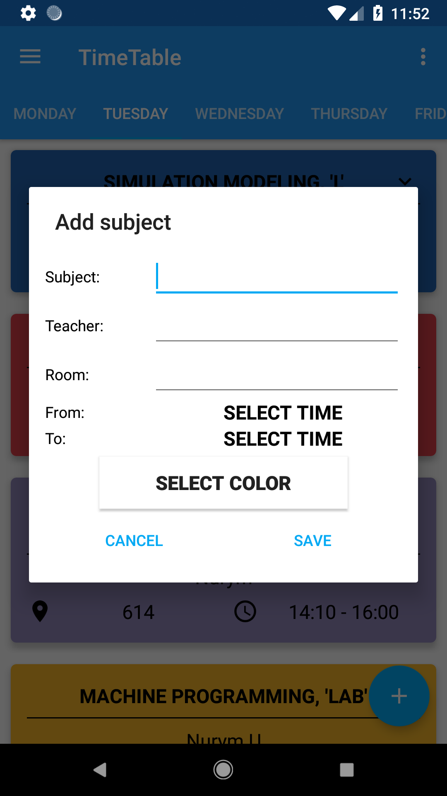
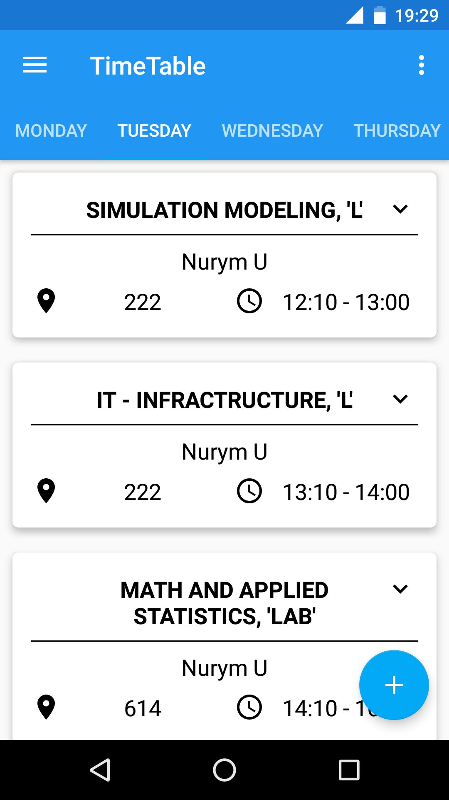

# TimeTable
<h1 align=center>

</h1>

Timetable is an Android Application, which allows you to save timetable and homeworks.

The source code is open, you can contribute to it.

# Screenshots
 &nbsp;&nbsp;&nbsp;&nbsp;  &nbsp;&nbsp;&nbsp;&nbsp; 
